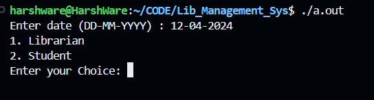
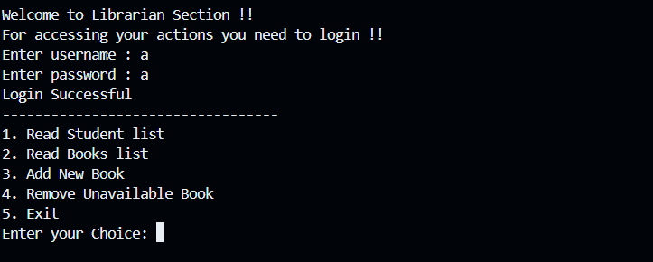

# Library Management System

## 📝 Description
A simple Library Management System that allows librarians to manage books, track borrowing and returning, and maintain records efficiently. It also allows students to issue or return books.
Don't forget to check Wiki.

## 🚀 Features
- The code is completely written in C++ using object-oriented programming.
- Integrated a CSV filesystem for tracking books, students, etc.
- Used RegEx for verifying dates, enrollment numbers, etc.
- Implemented password authentication for librarians.

## 🛠️ Installation
1. Clone the repository:
   ```sh
   git clone https://github.com/harsh-awasthik/Lib_Management_Sys.git
   cd Lib_Management_Sys
   ```

2. Install G++ Compiler (If not installed):
   ```sh
   sudo apt update
   sudo apt install g++
   ```
3. **Compile the Application using:**
   ```sh
   g++ management/main.cpp
   ```

4. Run the app:
`./a.out` (For linux/MacOS) or `./a.exe` (For Windows)

## Codebase:
 Check Wiki for Explanation of codes.


## 🤝 Contributing
1. Fork the repository.
2. Create a new branch: `git checkout -b feature-branch`
3. Commit changes: `git commit -m "Add new feature"`
4. Push: `git push origin feature-branch`
5. Open a Pull Request.


## Authors

- [@harsh-awasthik](https://github.com/harsh-awasthik)
- [@pragati-jain](https://github.com/CodeQuestor-hub)
- [@ayush-goyal](https://github.com/ayu-creatr)
- [@kunjal-varshney](https://github.com/Kunjal502)


## Screenshots





